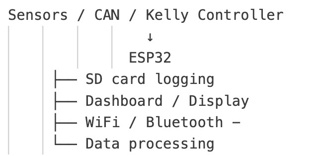
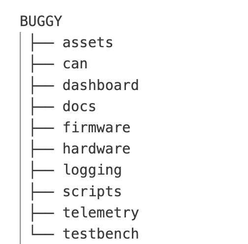

# BUGGY
Project Based Learning at Poznań University of Technology

# 1. OVERVIEW

Projekt polega na przeprojektowaniu spalinowego napędu w lekkim pojeździe terenowym typu „Buggy”, znajdującym się na stanie  Instytutu Napędów Lotnictwa Politechniki Poznańskiej na napęd zeroemisyjny. Pierwszym etapem jest przeprojektowanie całego układu napędowego i demontaż napędu konwencjonalnego wraz z podzespołami. Następnie odbędzie się montaż silnika elektrycznego, akumulatorów, sterownika i podzespołów oraz ogniwa paliwowego na wodór wraz z konwerterem. Kolejnym etapem jest stworzenie systemu akwizycji danych i zainstalowanie go w pojeździe. System ma za zadanie rejestrowanie na wyświetlaczu informacji o prądach, napięciach czy temperaturach danych podzespołów, a także zapisywanie ich oraz przesyłanie do użytkownika w formie cyfrowej. Pojazd będzie mógł być wykorzystywany jako demonstracja działania układu napędowego z ogniwem paliwowym na wodór w celach dydaktycznych. 

To repozytorium będzie prezentowało tworzenie systemu akwizycji danych oraz jego integracja z wyświetlaczem pojazdu.

# 2. GŁÓWNE CELE:

- odczyt danych z pojazdu:
    - ze sterownika KELLY przez magistrale CAN (oby)  
    - (moze) z czujnikow na pojezdzie

- logowanie danych w formacie .csv na karcie SD przy uzyciu modułu SD

- stworzenie dashboardu 

- docelowo wysylanie odczytanych danych na dashboard

# 3. ARCHITEKTURA NA TEN MOMENT (jak sobie to wyobrazam)

# 4. PLANOWANE FUNKCJONALNOŚCI

- zapis do CSV
- uzycie RTC timestamps (modul RTC to mniej niz 20 zlotych)
- przechowywanie danych na karcie SD
- dashboard pokazujacy biezace parametry --> szczegoloy do ustalenia, przede wszystkim czy staly 
widok czy ma byc jakas mozliwosc modyfikacji ze strony uzytkownika

PYTANIA
- czy powinny sie np automatycznie generowac jakies wykresy np. w pdf i zapisywac sie na karcie SD?

fajnie by bylo gdybys ktoś zarzadzajacy okreslili jak najbardziej 
konkretnie wymagane funkcjonalnosci :)

# 5. HARDWARE
- ESP32 (najlepiej 2, jeden mam, drugi ma amelka :))
- przetwornica 12V - 5V/3,3V
- wyświetlacz Nextion (chyba?)
- zasilacz laboratoryjny by sie przydal 
- kilka potencjometrow do symulacji fake danych
- modul RTC - np. DS3231 --> moim zdaniem niezbedny do fajnego loggingu danych, inaczej esp bedzie
tylko wiedzial ile czasu minelo od uruchomienia sesji, z tym bedzie precyzyjnie zawsze logowal date i godzine
- modul SD
- modul CAN, np. MCP2515
- przetwornik ADC, np. ADS1115 (analog to digital converter) --> esp ma to wbudowane ale slabe
- multimetr - chyba mam

# 6. struktura REPO - w kazdym folderze osobny .md ktory mowi mniej wiecej co sie dzieje tam

# 7. PARAMTERY KTÓRE MAJĄ BYĆ BADANE:

--> POWERTRAIN 
- prąd silnika [A]
- napięcie silnika [V]
- RPM silnika 
- przebieg [km]
- prędkość [km/h]

--> BATERIA 
- poziom baterii akumulatorów [%?]
- chyba prąd akumulatorów [A]
- chyba napięcie akumulatorów [V]

(pozniej jeszcze parametry wodorowe ale narazie nie)

to daje w sumie dwa typy danych telemetrycznych:

--> live telemetry (f=~10-50Hz)

    - prąd silnika [A]
    - napięcie silnika [V]
    - RPM silnika 
    - prędkość [km/h]
    - chyba prąd akumulatorów [A]
    - chyba napięcie akumulatorów [V]

--> slow telemetry (f=~1-5Hz)

    - poziom baterii akumulatorów [%?]
    - przebieg [km]

(potencjalnie temperatury itd. (chyba ze jakies mega dynamiczne))

 # 8. PLAN

1. Odczyt i logging fake telemetry
2. integracja z pojazdem
3. integracja fake telemetry z wyswietlaczem
4. integracja wyswietlacza z pojazdem

# 9. PYTANIA

1. czy kelly wysyla dane przez CAN i czy mozna je odczytac?
2. jakie dane kelly wysyla przez CAN?
3. jakie parametry mają iść bezpośrednio z sensorów?